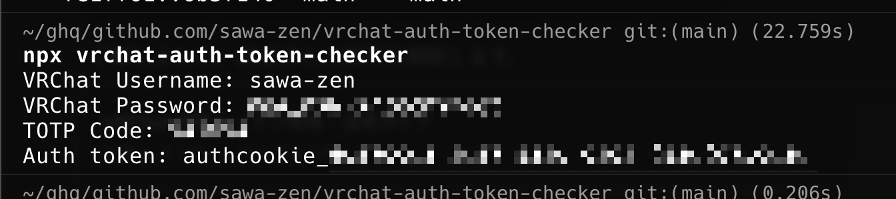

# vrchat-auth-token-checker

A CLI tool for easily obtaining VRChat API tokens. Since VRChat doesn't provide a direct way to issue API tokens, this tool helps you retrieve the token that is generated during login.



## Installation & Usage

You can use this tool without installation by running:

```bash
$ npx vrchat-auth-token-checker

VRChat Username: your-username
Password: ********

# If 2FA is enabled
2FA Code: 123456

# Success output
Auth Token: authcookie-xxxxx
```

The retrieved token can be used in headers when making requests to the VRChat API.

## Security

- Login credentials are used locally only and never sent to third parties
- Tokens are displayed only and not automatically saved

## License

See [LICENSE](./LICENSE) file for details.
